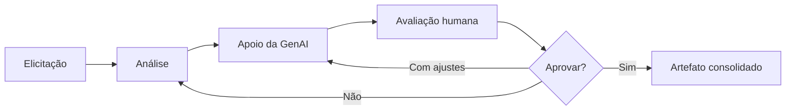

# Engenharia de Requisitos com apoio de GenAI — Eventus

Este repositório apresenta um exercício acadêmico de análise e especificação de requisitos para uma proposta de sistema centralizado de gestão de eventos da Eventus. O conteúdo registra o processo de Engenharia de Requisitos conduzido pelo autor com apoio de Inteligência Artificial Generativa (GenAI).

O repositório contém exclusivamente documentação de requisitos. Ele não corresponde a uma aplicação implementada.

## Contexto

A Eventus organiza conferências, workshops e eventos corporativos. No cenário inicial, inscrições, vagas, pagamentos, cancelamentos e certificados são administrados por meio de formulários online e planilhas, o que dificulta a centralização das informações e o controle das atividades.

O exercício estuda a documentação de uma solução centralizada para apoiar essa gestão. A elicitação identificou os seguintes stakeholders:

- Participantes;
- Organizadores;
- Equipe Financeira;
- Palestrantes;
- Equipe de TI.

A Equipe de TI foi reconhecida como stakeholder por desenvolver e manter o sistema. Entretanto, a elicitação disponível não apresentou necessidades funcionais próprias suficientes para originar funcionalidades específicas para esse perfil.

## Objetivo

O objetivo do trabalho foi transformar uma elicitação inicial em documentação estruturada de Engenharia de Requisitos, preservando a relação entre as necessidades declaradas, as regras do domínio, os pontos ainda indefinidos e os artefatos de especificação.

A GenAI foi utilizada como ferramenta de apoio ao processo, sob uma diretriz estabelecida pelo autor:

> Informações não fornecidas pelos stakeholders não deveriam ser transformadas em requisitos apenas para completar a documentação.

Assim, ambiguidades, dúvidas e informações ausentes foram registradas explicitamente como lacunas. O objetivo não foi maximizar a quantidade de documentos, mas produzir uma especificação coerente com as evidências disponíveis e transparente quanto aos seus limites.

## Condução do processo

O autor humano conduziu o trabalho desde a definição da estratégia até a consolidação dos artefatos. Sua atuação incluiu organizar o processo em etapas, revisar a interpretação da elicitação, avaliar classificações, controlar inferências, selecionar os artefatos adequados e decidir quais alterações poderiam ser incorporadas.

Também coube ao autor distinguir afirmações confirmadas de necessidades candidatas, revisar a rastreabilidade, avaliar diferenças semânticas e decidir quando uma questão deveria permanecer sem resposta até nova elicitação. As saídas elaboradas com apoio da GenAI foram tratadas como `propostas sujeitas a validação`, e não como documentação automaticamente aceita.

> A responsabilidade pelas decisões finais de Engenharia de Requisitos permaneceu com o autor, enquanto a GenAI foi empregada como instrumento de apoio à análise e à produção documental.

Essa dinâmica preservou a transparência sobre o uso da tecnologia sem reduzir a participação humana a uma revisão ao final do processo. A análise, a seleção, a validação, a rejeição de inferências e a consolidação ocorreram ao longo de todas as etapas.

## Metodologia

O processo foi iterativo e organizado em checkpoints:

1. Leitura e análise da elicitação.
2. Separação das informações em Requisitos Funcionais, Requisitos Não Funcionais, Regras de Negócio e Dúvidas e Lacunas.
3. Revisão crítica das classificações propostas.
4. Correção de inferências que ultrapassavam as evidências disponíveis.
5. Avaliação de possíveis artefatos de especificação.
6. Seleção dos artefatos pelo autor.
7. Elaboração e revisão das Histórias de Usuário.
8. Elaboração e revisão dos Casos de Uso.
9. Produção seletiva dos Critérios de Aceitação.
10. Construção da Matriz de Rastreabilidade.
11. Auditoria cruzada dos documentos.
12. Incorporação das correções pontuais aprovadas pelo autor.

A GenAI apoiou a organização das informações, a elaboração de versões iniciais e a comparação entre documentos. Cada checkpoint, porém, dependia de avaliação antes do avanço para a etapa seguinte. O fluxo adotado pode ser resumido como:

`análise → proposta assistida por GenAI → avaliação humana → decisão → consolidação`

## Fluxo de trabalho



A GenAI acelerou principalmente a análise, a organização e a comparação de conteúdo. A avaliação humana controlou as decisões incorporadas à especificação, inclusive quando uma proposta precisava ser rejeitada, limitada ou mantida como pendência.

## Artefatos produzidos

| Artefato | Quantidade | Documento |
| -------- | ---------: | --------- |
| Requisitos Funcionais | 18 | [Requisitos Funcionais](analise/requisitos-funcionais.md) |
| Requisitos Não Funcionais concretos | 0 | [Requisitos Não Funcionais](analise/requisitos-nao-funcionais.md) |
| Regras de Negócio | 8 | [Regras de Negócio](analise/regras-de-negocio.md) |
| Dúvidas e Lacunas | 30 | [Dúvidas e Lacunas](analise/duvidas-e-lacunas.md) |
| Histórias de Usuário | 15 | [Histórias de Usuário](especificacao/historias-de-usuario.md) |
| Casos de Uso | 6 | [Casos de Uso](especificacao/casos-de-uso.md) |
| Critérios de Aceitação | 7 | [Critérios de Aceitação](especificacao/criterios-de-aceitacao.md) |
| Matriz de Rastreabilidade | 1 | [Matriz de Rastreabilidade](especificacao/matriz-de-rastreabilidade.md) |

## Estrutura do repositório

```text
.
├── analise/
│   ├── requisitos-funcionais.md
│   ├── requisitos-nao-funcionais.md
│   ├── regras-de-negocio.md
│   └── duvidas-e-lacunas.md
│
├── especificacao/
│   ├── historias-de-usuario.md
│   ├── casos-de-uso.md
│   ├── criterios-de-aceitacao.md
│   └── matriz-de-rastreabilidade.md
│
└── README.md
```

## Principais decisões de Engenharia de Requisitos

As decisões abaixo ilustram como a documentação foi ajustada às evidências da elicitação, sem buscar uma completude artificial.

### RF-04 — comprovante de inscrição

A entrevista indicava que seria “interessante” receber um comprovante após a inscrição. Essa expressão identifica uma necessidade, mas não confirma que ela tenha sido aprovada como obrigatória ou priorizada.

Após analisar a proposta de classificação estruturada com apoio de GenAI, o autor decidiu manter RF-04 como `necessidade candidata`. O conteúdo, o formato, o meio de entrega, a prioridade e a obrigatoriedade continuam dependentes de validação com o stakeholder.

### Certificados

Em uma interpretação intermediária surgiu uma regra segundo a qual certificados somente poderiam ser emitidos depois do evento. A revisão da evidência mostrou que a elicitação sustentava o desejo do participante de emitir o certificado depois do evento, mas não autorizava estabelecer uma proibição absoluta para qualquer outro momento.

O autor decidiu remover a regra. Essa correção exemplifica a necessidade de separar uma interpretação plausível de um requisito efetivamente sustentado. A funcionalidade de emissão foi preservada, enquanto critérios de elegibilidade e eventual confirmação de presença permaneceram registrados como lacuna.

### RF-15 — eventos gratuitos e pagos

Na elaboração inicial das Histórias de Usuário, RF-15 foi agrupado com RF-13 e RF-16 em uma história da Equipe Financeira. A avaliação realizada pelo autor identificou que a elicitação afirmava apenas a existência de eventos gratuitos e pagos; ela não atribuía à Equipe Financeira a responsabilidade por definir, configurar, alterar ou manter essa modalidade.

A decisão adotada foi:

- retirar RF-15 de HU-12;
- manter HU-12 relacionada somente a RF-13 e RF-16;
- manter RF-15 sem História de Usuário própria nesta versão.

Essa ausência é deliberada e não exclui RF-15 do projeto. Nem todo Requisito Funcional precisa ser convertido artificialmente em uma História de Usuário quando o ator responsável e seu objetivo não estão suficientemente definidos.

### Seleção dos artefatos

Uma das combinações avaliadas com apoio de GenAI incluía Casos de Uso, Critérios de Aceitação, Matriz de Rastreabilidade e Diagrama de Estados. O autor não adotou integralmente essa proposta.

O Diagrama de Estados foi retirado porque os estados e as transições de inscrição, pagamento, ocupação de vagas e liberação ainda dependiam de diversas lacunas. Em seu lugar, optou-se por Histórias de Usuário, que permitiam representar os objetivos dos stakeholders sem forçar a definição de transições inexistentes.

A composição final decidida foi:

- Histórias de Usuário;
- Casos de Uso;
- Critérios de Aceitação seletivos;
- Matriz de Rastreabilidade.

Essa escolha demonstra a seleção humana dos artefatos de acordo com a maturidade das informações disponíveis.

### Cobertura seletiva

O autor decidiu não utilizar cobertura numérica de 100% como objetivo documental. Por isso, nem todo RF recebeu uma HU exclusiva, nem toda HU recebeu um CU e nem todo RF recebeu um CA.

A cobertura seletiva buscou evitar artefatos artificiais, repetição, inferências não sustentadas e uma falsa sensação de completude. RF-15 permaneceu sem HU própria, e somente 7 dos 18 RFs receberam Critério de Aceitação direto.

## Tratamento de dúvidas e lacunas

Durante a análise foram registradas 30 dúvidas, ambiguidades e lacunas. A decisão metodológica foi não preenchê-las automaticamente com práticas comuns ou soluções tecnicamente plausíveis.

Entre os temas ainda dependentes de elicitação complementar estão:

- prazo e demais condições de cancelamento;
- critérios e alcance do reembolso;
- obrigatoriedade e funcionamento da lista de espera;
- critérios de elegibilidade para certificado;
- momento de ocupação e liberação da vaga;
- significado operacional de “liberar” uma inscrição;
- tratamento de conflitos de horário;
- relação entre evento, workshop e atividade;
- segurança e controle de acesso;
- desempenho e volume de uso;
- disponibilidade e recuperação;
- acessibilidade;
- privacidade e tratamento de dados.

A existência de uma lacuna não representa falha da documentação. Ela registra, de maneira rastreável, uma informação que ainda precisa ser obtida junto aos stakeholders antes de se transformar em requisito, regra ou comportamento verificável.

## Requisitos não funcionais

Foram identificados `0 RNFs concretos`. Isso não significa que atributos de qualidade sejam irrelevantes, mas que a elicitação atual não forneceu evidências suficientes para formular requisitos mensuráveis e verificáveis.

RF-10, por exemplo, registra a expectativa de acompanhamento da quantidade de inscritos “em tempo real”. Entretanto, não foram definidos atraso aceitável, frequência de atualização, atualização automática ou SLA. Em vez de criar uma métrica arbitrária, o autor optou por manter o aspecto temporal como lacuna de desempenho.

Segurança, disponibilidade, acessibilidade, privacidade, confiabilidade e usabilidade também foram mantidas como áreas para elicitação complementar, sem métricas inventadas.

## Histórias de Usuário e Casos de Uso

As Histórias de Usuário representam necessidades segundo a perspectiva dos stakeholders e preservam a rastreabilidade com RFs, RNs e DLs. Foram produzidas 15 histórias, incluindo RF-04 e RF-09 com status de candidatas.

Os Casos de Uso representam objetivos em que a descrição de interações, regras, alternativas e pontos pendentes agrega informação. Foram selecionados 6 CUs, sem a intenção de transformar cada RF ou HU em um fluxo independente.

Todos os Casos de Uso foram mantidos como parcialmente especificados quando dependiam de lacunas abertas. Essa foi uma escolha consciente: um fluxo parcial, com seus limites explícitos, foi considerado mais fiel do que um fluxo aparentemente completo construído com suposições.

## Critérios de Aceitação seletivos

Foram criados apenas `7 Critérios de Aceitação`. O autor decidiu que um CA somente deveria existir quando fosse possível identificar contexto, ação e resultado verificáveis com base no material consolidado.

Quando a formulação exigia resolver uma DL ainda aberta, o critério não foi produzido. Entre os comportamentos que receberam critérios estão:

- impedimento do cancelamento quando o evento não o admite;
- registro da confirmação de pagamento pela Equipe Financeira;
- consulta da programação pelo palestrante.

A quantidade reduzida de CAs não representa omissão por descuido. Ela decorre da maturidade da elicitação e da decisão de evitar critérios aparentemente objetivos apoiados em premissas inexistentes.

## Rastreabilidade

A Matriz de Rastreabilidade utiliza os Requisitos Funcionais como unidade principal e relaciona:

`RF → fonte → RN → DL → HU → CU → CA`

Ela permite visualizar tanto relações existentes quanto ausências deliberadas. RF-15, por exemplo, aparece sem HU própria, mas permanece relacionado à sua fonte, regra, lacunas e ao CU em que figura apenas como condição de domínio.

Uma revisão da matriz identificou que a relação `RF-02 → DL-30`, já presente nos artefatos relacionados à inscrição, não havia sido refletida na linha principal. Após avaliação, essa relação foi incorporada à matriz e à visão de impacto transversal de DL-30.

## Auditoria de consistência

Após a consolidação dos artefatos, foi realizada uma auditoria cruzada de identificadores, fontes, regras, lacunas, relações e terminologia. O inventário final confirmado foi:

- 18 RF;
- 8 RN;
- 30 DL;
- 15 HU;
- 6 CU;
- 7 CA;
- 0 RNF concreto.

A auditoria não encontrou problemas críticos. Foi identificado um ponto moderado em CA-04: o critério utilizava `quantidade de inscrições`, enquanto RF-10 e HU-10 utilizavam `quantidade de inscritos`.

Como os conceitos poderiam não representar necessariamente a mesma unidade, o autor decidiu alinhar CA-04 à linguagem original do requisito. A redação passou a utilizar `quantidade de inscritos`, sem definir se a contagem considera pessoas únicas, registros de inscrição ou algum nível específico de evento ou atividade. A auditoria serviu como apoio à identificação; a alteração foi incorporada após avaliação humana.

## Apoio da GenAI

A GenAI foi utilizada para estruturar informações, apoiar classificações iniciais, gerar propostas documentais, sugerir agrupamentos, confrontar referências, localizar possíveis inconsistências e acelerar tarefas repetitivas de documentação e auditoria.

A ferramenta não recebeu autoridade para aprovar requisitos, resolver lacunas, definir regras por conta própria, escolher sozinha o escopo final ou determinar quais sugestões seriam incorporadas.

> A GenAI foi utilizada como uma ferramenta de apoio ao raciocínio e à produção documental. Suas respostas foram tratadas como insumos para análise, e não como decisões finais.

## Papel da avaliação humana

A participação humana ocorreu durante todo o processo. O autor estabeleceu a estratégia, avaliou evidências, selecionou os artefatos, examinou a rastreabilidade e decidiu quando uma proposta aparentemente plausível não estava suficientemente sustentada.

Entre as decisões tomadas ao longo do trabalho estão:

- manter RF-04 como necessidade candidata;
- manter RF-09 como necessidade candidata;
- remover a regra inadequadamente inferida sobre certificados;
- retirar RF-15 de HU-12 e mantê-lo sem HU própria;
- não produzir o Diagrama de Estados nesta versão;
- adotar Critérios de Aceitação seletivos;
- corrigir a relação de rastreabilidade entre RF-02 e DL-30;
- corrigir a diferença semântica entre “inscritos” e “inscrições”.

Essas decisões evidenciam que o uso de GenAI em Engenharia de Requisitos exige julgamento, domínio do contexto, análise de evidências, controle de inferências e disposição para manter perguntas sem resposta quando a elicitação não oferece base segura.

## Reflexão sobre GenAI na Engenharia de Requisitos

Neste trabalho, o principal benefício observado foi a velocidade para organizar um volume crescente de informações. A GenAI auxiliou a transformar entrevistas e interesses de stakeholders em propostas estruturadas, mantendo formatos consistentes e facilitando a comparação entre requisitos, histórias, casos, critérios e matriz.

O apoio também foi útil em tarefas de rastreabilidade. A comparação sistemática de identificadores e referências reduziu o esforço repetitivo e ajudou a localizar ausências como a relação entre RF-02 e DL-30. Da mesma forma, a auditoria terminológica tornou visível a diferença entre “inscritos” e “inscrições”.

Esses benefícios não eliminam riscos. Formulações linguisticamente plausíveis podem converter desejos em obrigações, como poderia ocorrer com o comprovante e a lista de espera. A ferramenta também pode preencher lacunas com práticas comuns de mercado, ainda que autenticação, canais de comunicação, meios de pagamento ou políticas operacionais não tenham sido elicitados.

Outro risco é atribuir atores e responsabilidades sem evidência. O agrupamento inicial de RF-15 com uma história da Equipe Financeira parecia coerente com o tema financeiro, mas extrapolava o que havia sido declarado. A análise humana foi necessária para distinguir a fonte da informação da responsabilidade por manter a modalidade do evento.

Há ainda uma tendência de produzir fluxos completos e muitos artefatos para alcançar cobertura numérica. Neste exercício, isso poderia gerar estados de inscrição inventados, regras de vaga presumidas, critérios de reembolso inexistentes e cenários de aceite apoiados em premissas indefinidas. A opção por CUs parciais e CAs seletivos reduziu esse risco.

O ganho de produtividade, portanto, depende da capacidade do profissional de questionar, comparar, validar, rejeitar e revisar as propostas. A tecnologia ampliou a capacidade de análise e reduziu o trabalho mecânico, mas as decisões exigiram compreensão do domínio e responsabilidade sobre as consequências documentais.

GenAI pode ampliar a produtividade do engenheiro de requisitos, mas não substitui o julgamento necessário para distinguir evidência, interpretação, hipótese e decisão. Neste processo, o autor conduziu, selecionou, validou e consolidou; a ferramenta apoiou essas atividades sem assumir sua responsabilidade decisória.

## Limitações e próximos passos

A documentação representa o nível de especificação possível a partir da elicitação atual. Antes de uma implementação real, seriam necessárias novas rodadas de elicitação e validação com os stakeholders.

As prioridades incluem esclarecer:

- a estrutura entre evento, workshop e atividade;
- os dados e o processo de inscrição;
- o controle, a reserva e a liberação de vagas;
- o pagamento e o significado da liberação condicionada;
- as condições de cancelamento e reembolso;
- os critérios para emissão de certificado;
- segurança e controle de acesso;
- privacidade e tratamento de dados;
- desempenho e volumes esperados;
- disponibilidade e recuperação.

Esses tópicos permanecem como perguntas de elicitação. O repositório não propõe respostas para eles.

## Escopo do repositório

Este repositório contém documentação de Engenharia de Requisitos produzida para fins acadêmicos. O objetivo foi analisar a elicitação, estruturar necessidades, registrar incertezas, especificar comportamentos sustentados e manter sua rastreabilidade.

Não foram produzidos nesta etapa:

- código de aplicação;
- banco de dados;
- API;
- interface de usuário;
- arquitetura de software;
- infraestrutura;
- implementação funcional.
